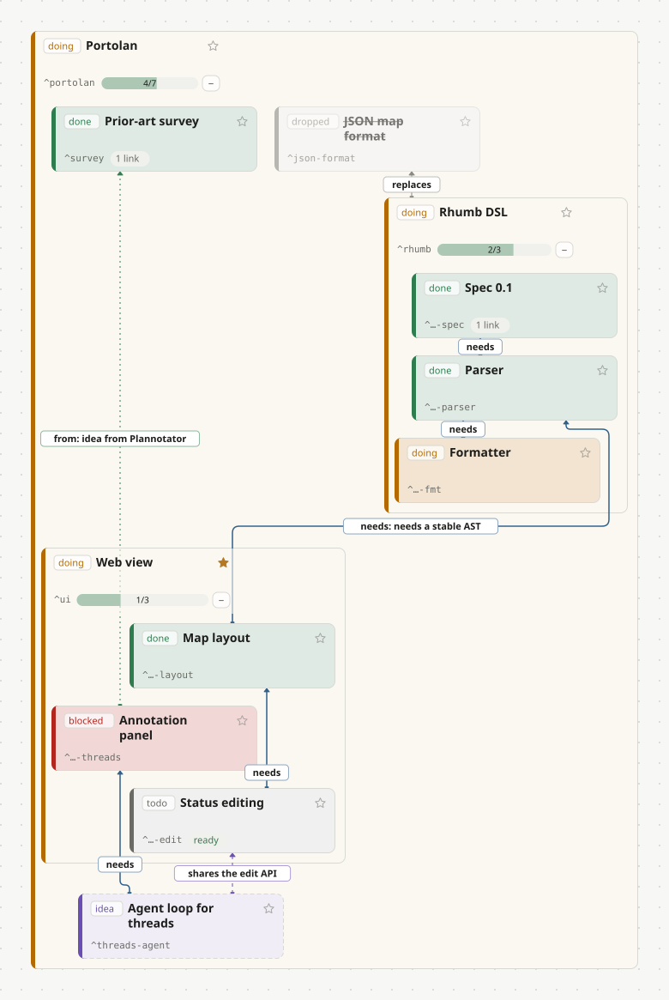

<p align="center">
  
</p>

<h1 align="center">Portolan</h1>

Portolan is a shared map of work for humans and AI agents. It is a mind map that is also a TODO list and a task log, showing the relations, progress and plans across an agent's whole workflow.

**[Live demo](https://k-l-lambda.github.io/portolan/)**: Portolan's own development map in the web view (read-only), with every link opening its entry in the [changelog](docs/changelog.md).

## Why

Agents now do long, branching work: surveys, experiments, refactors that split into sub-tasks and depend on each other. Logs and diaries record what happened, but not the shape of the work. Chat history is linear. It is hard to see what is done, what is blocked and what comes next.

Existing tools cover pieces of this. Agent task trackers keep a task graph, mind-map UIs draw trees, plan-annotation tools let you comment on an agent's plan. None of them gives one shared map that is human-readable, git-friendly, and edited by both the human and the agent.

## Core ideas

- The map holds structure only: work items, status, hierarchy and relations. Details stay in the diary, and the map links into it.
- The map is plain text in the Rhumb DSL (`.rhumb`). It is designed to be easy for LLMs to write: it borrows GFM task lists, YAML and Markdown links, and adds only a small sentence syntax for edges.
- It is designed to diff well in git: one change is one line.
- Annotations live in a sidecar file next to the map, so humans and agents can discuss a node in a thread without cluttering the map.

## The name

A portolan chart was a nautical map drawn from sailors' logbooks, with rhumb lines connecting the ports. It is a map that grows out of logs, which is what this project tries to be. Rhumb is the name of the DSL; its edges are the rhumb lines between work items.

## What a map looks like

[`docs/example.rhumb`](docs/example.rhumb):

```rhumb
---
rhumb: 0.1
title: Portolan
---

- [/] Portolan ^portolan
  - [x] Prior-art survey ^survey
    - Why: reuse what exists; only build the shared map that nothing else provides.
    - Closest pieces: [Backlog.md](https://github.com/MrLesk/Backlog.md), Beads, Plannotator
  - [/] Rhumb DSL {owner: claude} ^rhumb
    - [x] Spec 0.1 ^rhumb-spec
      - [spec](https://github.com/k-l-lambda/portolan/blob/main/docs/rhumb-spec.md)
    - [x] Parser ^rhumb-parser
    - [/] Formatter ^rhumb-fmt
  - [/] Web view {star: true} ^ui
    - [x] Map layout ^ui-layout
    - [ ] Status editing ^ui-edit
    - [!] Annotation panel ^ui-threads
      - Blocked: the thread format is not settled
  - [?] Agent loop for threads ^threads-agent
  - [-] JSON map format ^json-format
    - Dropped: hard for people and agents to write by hand

%% relations
rhumb-parser needs rhumb-spec
rhumb-fmt needs rhumb-parser
ui-layout needs rhumb-parser: needs a stable AST
ui-edit needs ui-layout
threads-agent needs ui-threads
threads-agent relates ui-edit: shares the edit API
rhumb replaces json-format
ui-threads from survey: idea from Plannotator
```

The same map in the web view:

<p align="center">
  
</p>

Each `- [ ]` item is a node with a status (`[ ]` todo, `[/]` doing, `[x]` done, `[-]` dropped, `[!]` blocked, `[?]` idea) and a stable `^id`. Items without a checkbox are notes. Links are anchors into the diary or elsewhere. `{star: true}` marks a shared favorite. Lines like `a needs b` are edges: `needs` and `blocks` set the order of work, `relates` (with a label for domain meaning), `replaces` and `from` record the rest. Progress and readiness are derived by the tools, never stored in the file.

## Status

Portolan is experimental and changing quickly. What exists today:

- Rhumb 0.1 spec and a Peggy-based parser with tests
- `check` (parse errors, consistency, anchor resolution) and a first `fmt` (assigns missing IDs, normalizes status aliases)
- An edit API (set status, add or delete nodes, rename IDs, add or remove edges) that keeps untouched lines intact
- A thread store for annotations in an append-only `.threads.jsonl` sidecar
- A local server that serves the map, derived values and threads, and pushes file changes live
- A first web view, with a mind map and a diary panel, still being built

The server has no authentication and binds to `127.0.0.1` only. Do not expose it.

Next:

- Annotation UI in the web view
- An agent loop that delivers human comments in threads to the agent and writes replies back
- A fuller formatter

## Install

```sh
npm install -g @k-l-lambda/portolan   # or: npx @k-l-lambda/portolan serve <dir>
portolan serve path/to/maps            # then open http://127.0.0.1:4310
rhumb check path/to/plan.rhumb
```

The package ships the compiled CLI, the library API (`import { parse } from "@k-l-lambda/portolan"`) and the built web app. It needs Node 22.12 or newer.

## Quick start

pnpm is required. `npm install` crashes with npm 10.9 on this dependency set.

```sh
pnpm install
pnpm test
pnpm build:web

node src/cli.ts check docs/demo/portolan.rhumb   # the project's own map
node src/cli.ts serve docs
```

Then open http://127.0.0.1:4310.

## Docs

- [docs/rhumb-spec.md](docs/rhumb-spec.md): the Rhumb 0.1 syntax specification
- [docs/skill.md](docs/skill.md): guide for agents that maintain a Rhumb map
- [docs/demo/](docs/demo): maps shown in the [live demo](https://k-l-lambda.github.io/portolan/); [portolan.rhumb](docs/demo/portolan.rhumb) is the map Portolan itself is developed with
- [docs/changelog.md](docs/changelog.md): how Portolan was built, entry by entry; the project map links into it
- [docs/example.rhumb](docs/example.rhumb): the example above; `pnpm example:svg` redraws [docs/example.svg](docs/example.svg) from it

## Releasing

Bump `version` in `package.json` and push to `main`. The [publish workflow](.github/workflows/publish.yml) publishes that version to npm if it is not there yet, using npm Trusted Publishing (no token secret; provenance is added automatically).

The very first release has to be published by hand (`npm publish --access public`), because a trusted publisher can only be configured on a package that already exists. After that, on npmjs.com open the package settings, add a Trusted Publisher for GitHub Actions with user `k-l-lambda`, repository `portolan` and workflow `publish.yml`.

